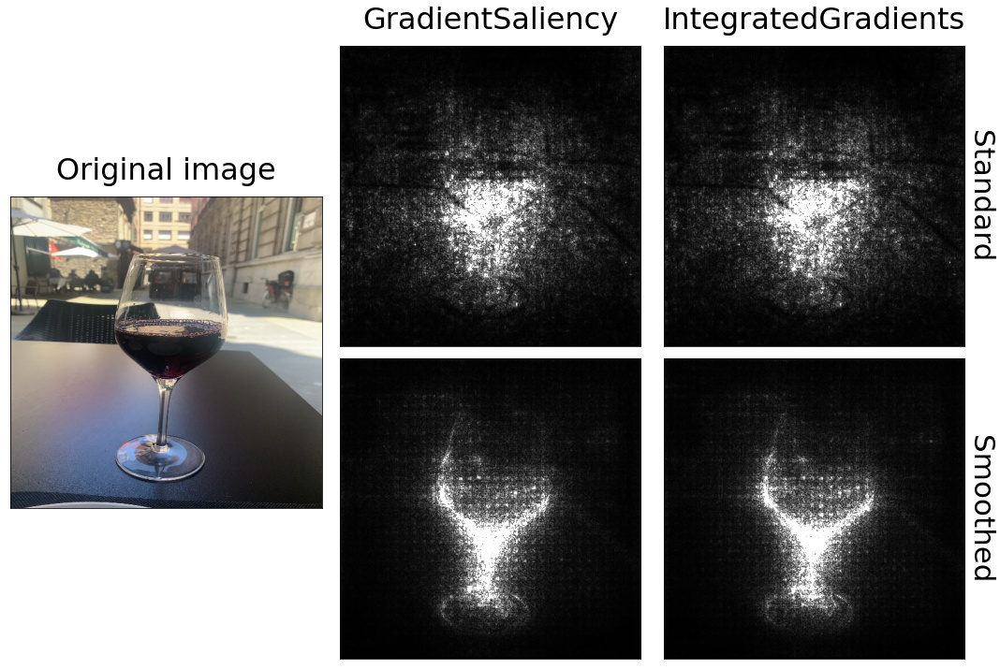

DEEP Open Catalogue: Image classification
=========================================

**Author:** [Miriam Cobo](https://github.com/MiriamCobo) (CSIC)

**Description:** This work provides a validated tool to train and evaluate an image regression model to measure wine volume in single-view images. The code is fine-tuned for a consumer study as part of the [BrainGut-WineUp](https://github.com/MiriamCobo/BrainGut-WineUp.git) project. 

**Project:** This study was supported by MCIN (Ministerio de Ciencia e Innovación)/AEI (Agencia Estatal de Investigación)/10.13039/501100011033 through the projects PID2019-108851RB-C21 and PID2019-108851RB-C22, and ‘Prueba de concepto’ PDC2022-133861-C21 and PDC2022-133861-C22.

This work is an adaptation to regression tasks of the original image classification [DEEP Hybrid-DataCloud](https://deep-hybrid-datacloud.eu/) project that has received funding from the European Union’s Horizon 2020 research and innovation programme under grant agreement No 777435 developed by [Ignacio Heredia](https://github.com/IgnacioHeredia). You can find more information about it in the [DEEP Marketplace](https://marketplace.deep-hybrid-datacloud.eu/modules/deep-oc-image-classification-tf.html).

**Table of contents**
1. [Local installation](#local-installation)
2. [Notebooks content](#notebooks-content)
3. [Description of the adaptations from the previous code](#description-of-the-adaptations-from-the-previous-code)
4. [Acknowledgements](#acknowledgments)


## Local installation

> **Requirements**
>
> This project has been tested in Ubuntu 18.04 with Python 3.8.6. Further package requirements are described in the
> `requirements.txt` file.
> - It is a requirement to have [Tensorflow>=1.14.0 installed](https://www.tensorflow.org/install/pip) (either in gpu 
> or cpu mode). This is not listed in the `requirements.txt` as it [breaks GPU support](https://github.com/tensorflow/tensorflow/issues/7166). 
> - Run `python -c 'import cv2'` to check that you installed correctly the `opencv-python` package (sometimes
> [dependencies are missed](https://stackoverflow.com/questions/47113029/importerror-libsm-so-6-cannot-open-shared-object-file-no-such-file-or-directo) in `pip` installations).

To start using this framework clone the repo and download the [weights](https://api.cloud.ifca.es:8080/swift/v1/imagenet-tf/default_imagenet.tar.xz): ### check!

```bash
git clone https://github.com/deephdc/image-classification-tf
cd image-classification-tf
pip install -e .
curl -o ./models/default_imagenet.tar.xz https://api.cloud.ifca.es:8080/swift/v1/imagenet-tf/default_imagenet.tar.xz
cd models && tar -xf default_imagenet.tar.xz && rm default_imagenet.tar.xz
```

### 1. Data preprocessing

The first step to predict the volume of wine in a glass from an image is to have the data correctly set up. 

#### 1.1 Prepare the images

Set the `image_dir` path to the images in the training args. 
Please use a standard image format (like `.png`, `.jpeg` or `.jpg`). 

#### 1.2 Prepare the data splits

Add to the `./data/dataset_files` directory the following files:

| *Mandatory files* | *Optional files*  | 
|:-----------------------:|:---------------------:|
|  `classes.txt`, `train.txt` |  `val.txt`, `test.txt`, `info.txt`|

The `train.txt`, `val.txt` and `test.txt` files associate an image name (or relative path) to the measured volume of wine in the glass, which is separated by an *. You can find examples of these files at  `./data/demo-dataset_files`.

### 2. Train the model

If you wish to fine-tune the regression model with your own data you can load the weights of the ["daily lifelike" images dataset](https://doi.org/10.20350/digitalCSIC/14816) pretrained model and re-train the last layers of the convolutional neural network model.

## Notebooks content

You can have more info on how to interact directly with the module by examining the ``./notebooks`` folder:

* [examples of glasses notebook](./notebooks/0.0-ExamplesOfGlasses.ipynb):
  Visualize examples of the liquid containers used to train the classifier.

* [model training notebook](./notebooks/1.0-Model_training.ipynb):
  Visualize training and validation model statistics.

* [computing predictions notebook](./notebooks/2.0-Computing_predictions.ipynb):
  Test the classifier on multiple images.
  
* [prediction statistics daily lifelike dataset notebook](./notebooks/3.0-Prediction_statistics_DailyLifelikeDataset.ipynb):
  Make and store the predictions of the test.txt file corresponding to daily lifelike images dataset. Once you have done that you can visualize the statistics of the predictions like popular metrics (Mean Abosulte Error, Root Mean Squared Error and Coefficient of Determination) and visualize violin plots of the predictions.
  
* [prediction statistics real dataset notebook](./notebooks/3.0-Prediction_statistics_RealDataset.ipynb):
  Make and store the predictions of the test.txt file corresponding to real images dataset. Once you have done that you can visualize the statistics of the predictions like popular metrics (Mean Abosulte Error, Root Mean Squared Error and Coefficient of Determination) and visualize violin plots of the predictions.

* [saliency maps notebook](./notebooks/3.2-Saliency_maps.ipynb):
  Visualize the saliency maps of the predicted images, which highlight the most relevant pixels that were taken into consideration to make the prediction.




## Description of the adaptations from the previous code

The main changes of the prior [BrainGut_WineUp code](https://github.com/MiriamCobo/BrainGut-WineUp.git) were done in order to fine-tune the previous [laboratory images dataset](https://digital.csic.es/handle/10261/256232) deep learning model with the ["daily lifelike" images dataset](https://doi.org/10.20350/digitalCSIC/14816):

* [model_utils.py](./imgclas/model_utils.py):
  Load pretrained laboratory model.

* [utils.py](./imgclas/utils.py):
  Set early stopping configuration.

We also employed the [real images dataset](https:// doi.org/10.20350/digitalCSIC/14817) to perform an independent external validation of the model.

## Acknowledgements

If you consider this project to be useful, please consider citing this repository.